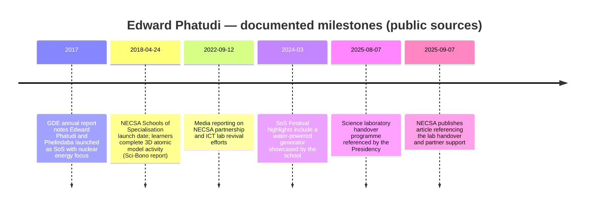
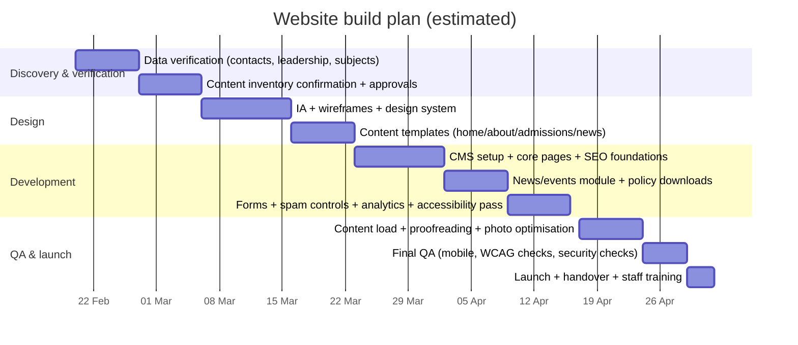

# Edward Phatudi Maths, Science & ICT School of Specialisation in — Website-Ready Research Report

## Executive summary

Edward Phatudi operates as a public secondary school in the Tshwane region and is formally referenced in government systems under at least two closely related names: “Edward Phatudi Secondary School” and “Edward Phatudi Comprehensive School”, with the specialised stream presented as “Edward Phatudi Maths, Science and ICT School of Specialisation”. citeturn25view0turn33view0turn35view0 The school is listed under the Tshwane South district (District: TS) and is associated with EMIS identifiers 231639 (GDE vacancy circular format) / 700231639 (national-format reference used in DBE reporting). citeturn25view0turn19view0

The school’s publicly documented “specialisation” positioning is materially linked to **nuclear science/technology** (as part of Gauteng’s Schools of Specialisation programme) via documented cooperation with entity["company","South African Nuclear Energy Corporation","state-owned nuclear entity"] (NECSA). citeturn29view4turn29view2turn21view3 Formal reporting by the provincial department places Edward Phatudi and Phelindaba in the “Northern Corridor” as Schools of Specialisation with a special focus on nuclear energy. citeturn29view4 A key recent infrastructure milestone is the handover of science laboratory facilities to the school in August 2025 as part of a multi-party initiative referenced by entity["organization","The Presidency","south african government office"], and further described by NECSA as involving donated equipment/technology (including corporate partners). citeturn29view1turn31view0

Performance data in the national School Performance Report (NSC) shows the school’s overall NSC “% Achieved” for 2023–2025 as **82.5% (2023)**, **72.0% (2024)**, and **58.8% (2025)**, with “Total Wrote” (NSC candidates) **143 (2023)**, **246 (2024)**, and **211 (2025)**. citeturn19view0 This trend is material for website messaging: it strengthens the need for transparent improvement narratives (support programmes, partnerships, lab upgrade impact) rather than purely promotional copy.

The most reliable “website-ready” information available from primary/official sources is **identity, district, contact channels, address, roll (enrolment proxy), specialisation rationale, and multi-year NSC outcomes**. citeturn25view0turn34view0turn19view0turn29view4 Several items requested for the site (formal mission/vision statements, complete staff establishment/qualifications, full subject packages per grade, timetable structure, SGB membership lists, school-level annual reports/newsletters) are **not publicly accessible in the sources reviewed** and should be treated as **unspecified** until confirmed directly with the school and/or district. citeturn34view0turn25view0

A practical publishing note: the domain listed in directories for the school’s specialist identity (“edwardphatudimstsos.co.za”) was not reachable during this research (HTTP 502 error observed via attempted fetch), so a new site launch can immediately improve credibility and parent-facing service delivery. citeturn3view0turn10search0

## Verified identity, location and contact details

The table below consolidates the **most defensible, primary-source-aligned** data points suitable for a public-facing website. Where independent directories conflict with official documents, the official record is prioritised and inconsistencies are flagged.

| Item | Website-ready value | Source confidence | Notes |
|---|---|---:|---|
| Official school name (DBE/NSC reporting) | **entity["organization","Edward Phatudi Secondary School","saulsville pretoria tshwane"]** | High | Appears in NSC School Performance Report and GDE vacancy circulars. citeturn19view0turn25view0 |
| Alternate/legacy name (GDE documents) | **entity["organization","Edward Phatudi Comprehensive School","saulsville pretoria tshwane"]** | High | Used in GDE vacancy circular (2020) and other references. citeturn33view0turn31view0 |
| “School of Specialisation” name used for admissions | Edward Phatudi Maths, Science and ICT School of Specialisation | High | Listed on GDE e-Admissions Schools of Specialisation assessment dates page. citeturn35view0 |
| Governing provincial department | entity["organization","Gauteng Department of Education","provincial education authority"] | High | Provincial education authority referenced across official docs. citeturn29view4turn25view0 |
| Education district | entity["organization","Tshwane South District","gde district ts"] | High | Explicitly stated as “District Name: TSHWANE SOUTH District: TS” in GDE vacancy circular copy. citeturn25view3turn25view0 |
| National EMIS reference | EMIS: **700231639** | High | Used in DBE School Performance Report; GDE vacancy circular lists EMIS “231639” (format variation). citeturn19view0turn25view0 |
| NSC examination centre number | Centre No: **8231639** | High | NSC School Performance Report listing. citeturn19view0 |
| Physical address (official document format) | 7909 Makaza Street, Saulsville, entity["place","Atteridgeville","pretoria tshwane township"], entity["city","Pretoria","gauteng, south africa"] | High | Address is explicit in vacancy circular (2022); spelling/numbering variants exist in other sources. citeturn25view0turn33view0 |
| GPS coordinates | Lat **-25.777809**, Lon **28.049543** | Medium–High | Appears in DBE dataset snippet (LinkClick file listing). Cross-check aligns closely with OSM-based coordinates. citeturn23search2turn16view0 |
| Main telephone | **012 375 8267** | High | Listed in GDE vacancy circulars. citeturn25view0turn33view0 |
| Additional contact numbers (SoS admissions) | **082 557 1671** / **012 375 8367** | Medium–High | Listed for the SoS stream on GDE e-Admissions SoS test schedule. citeturn35view0 |
| Email (SoS admissions) | **EdwardPhatudicompr@gmail.com** / **ptlhomeli@gmail.com** | Medium–High | Published on GDE e-Admissions SoS test schedule. citeturn35view0 |
| Website | edwardphatudimstsos.co.za | Medium | Listed in third-party map listing; site unreachable at time of research (502). citeturn10search0turn3view0 |
| Social media | Unspecified | Low–Medium | Public social presence appears to exist (e.g., location listings), but “official” status cannot be confirmed from primary sources. citeturn23search25 |

**Address normalisation note for the new website:** Use the **7909 Makaza Street, Saulsville, Atteridgeville** form as the canonical display address (because it appears in an education-sector vacancy circular entry alongside the school’s EMIS and district), and store alternative spellings (Makaza/Makhaza) as internal synonyms for search and SEO. citeturn25view0turn33view0

## Governance, leadership and organisational context

As a public school, governance is vested in the School Governing Body (SGB), while professional management is carried out by the principal under the authority of the Head of Department, as set out in the entity["organization","South African Government","national government"] publication of the South African Schools Act. citeturn38search1 This framing matters for the website: governance content (policies, fees, admissions posture, language approach) should clearly distinguish “SGB governance” from “school management (principal/SMT)”.

For Schools of Specialisation specifically, the GDE admissions guidance references the regulatory basis for placement tests (written tests/auditions/sport trials), stating that only learners who pass qualify to be placed on the admissions list and that parents should also apply to mainstream schools. citeturn34view0

### Leadership snapshot for publishing

| Role | Name | Bio summary for web use | Status |
|---|---|---|---|
| Principal | entity["people","Willie Mkhwanazi","principal, sa public school"] | Publicly quoted as principal; describes partnership work with NECSA to expose learners to nuclear science careers and efforts to revive ICT capacity (computer lab) with university support. citeturn21view3 | Verified via media (primary school-issued bio: unspecified) |
| School Management Team (deputy principals, HODs) | Unspecified | Publish only once confirmed by the school; vacancy circular references “enquiries” contacts but does not enumerate leadership structure. citeturn25view0turn33view0 | Unspecified |
| SGB chair & SGB membership | Unspecified | The site should provide SGB term dates, contact channel, and election notices once confirmed. (Evidence not located in public sources.) | Unspecified |

**Recommendation for evidence quality on the new site:** Add a “Leadership & Governance” page that includes a short **principal message**, a **named SMT directory**, and an **SGB overview**, all signed off by the school and district before publishing. This materially reduces reputational risk from third-party directory inaccuracies. citeturn38search1

## History, positioning and specialisation focus

GDE’s 2017/18 Annual Report describes the establishment of Schools of Specialisation as part of the province’s development corridors and specifically states that **Edward Phatudi and Phelindaba Secondary Schools were launched with a special focus on Nuclear Energy** (Northern Corridor). citeturn29view4 This is the most authoritative available “origin story” for the school’s specialist identity.

A second authoritative layer comes from the entity["organization","Sci-Bono Discovery Centre","science centre johannesburg"] 2018/19 annual report, which references the launch of the NECSA-focused Schools of Specialisation on **24 April 2018**, listing “Edward Phatudi (TS)” and noting a launch activity where learners “designed and animated 3D Atomic Models.” citeturn29view3 This is directly usable for a website timeline and for “why specialisation” messaging.

Government communication (Vuk’uzenzele / GCIS) positions the initiative as a pilot partnership between education authorities and NECSA, aiming to implement an industry-specific curriculum focus on nuclear technology and its applications, including uses in medical, agriculture, automotive, aviation and mining contexts. citeturn29view2

GDE’s admissions documentation further defines Schools of Specialisation as targeting top-performing learners, operating with distinct models (including funding sources, learner/teacher sourcing, curriculum, post-matric support), with curricula strongly focused on a specialist area and often including extended hours. citeturn34view0

## Academic offer and curriculum alignment

### Curriculum baseline

The school, as a public secondary institution, is expected to align its mainstream subjects to the national Curriculum and Assessment Policy Statements (CAPS), which the entity["organization","Department of Basic Education","national education department"] describes as the policy documents replacing earlier subject statements and guidelines for subjects in Grades R–12. citeturn38search0turn38search4

### Grade levels and subject evidence from education-sector documents

Public education vacancy circular data provides hard evidence that the school spans **Grades 8–12**, because posts are advertised against learning areas across these grades, including “English 8–12” and “Mathematics 8–12” as well as FET-specific subjects. citeturn33view0turn25view0

The same documents indicate that, beyond the School of Specialisation framing, the school also has curriculum/skills components consistent with a “comprehensive”/technology-linked profile, including:
- **Technology (Grades 8–9)** and **Mechanical Technology (Grades 10–12)** referenced via post requirements. citeturn33view0
- Language learning and teaching is listed as **LOLT: English**, with Sepedi Home Language referenced in a post category. citeturn33view0turn25view0  
- Broader language offering, as described in media reporting, includes options such as isiZulu, Setswana, Xitsonga and Sepedi as home language choices, with English offered as an additional language. citeturn21view3

**Specialisation focus:** In public narrative and provincial reporting, the Maths/Science/ICT specialisation is tied to **nuclear science/technology** exposure and related career pathways. citeturn29view4turn21view3turn29view2

### Academic structure and timetable (availability)

A detailed bell timetable/period structure for Edward Phatudi is **unspecified** in the publicly accessible documents reviewed. The GDE admissions guidance does, however, describe Schools of Specialisation as often having **extended curriculum and extended school hours**, which should influence the site’s messaging even if the precise timetable is confirmed later. citeturn34view0

**Website-ready recommendation (pending verification):** Publish a “typical day” structure (start time, number of periods, break times, afternoon programmes) only after the school confirms it; until then, describe extended learning as a programme feature without hard times.

## Facilities, learner experience and community engagement

### Confirmed facilities and infrastructure signals

Recent, high-authority signals indicate strengthened science infrastructure:

- A Presidency speech (Mandela Day/lab handover) explicitly references **handover of science laboratories** to Edward Phatudi Comprehensive as one of four Atteridgeville schools, framed as enabling opportunity and foundational infrastructure for science and technology. citeturn29view1  
- NECSA’s own site describes the same initiative as a collaborative programme, naming Edward Phatudi Comprehensive School among beneficiaries and stating that NECSA and a tech partner donated equipment/technology. citeturn31view0  

In addition, the principal has publicly described efforts to resuscitate a computer lab with support from entity["organization","University of Pretoria","public university pretoria"]. citeturn21view3

### Facilities matrix for the new website

| Facility / capability | Publicly evidenced? | Evidence | Website publishing status |
|---|---:|---|---|
| Science laboratory/labs | Yes | Lab handover referenced by Presidency and NECSA. citeturn29view1turn31view0 | Publish “confirmed”; add photos once school provides originals |
| ICT lab / computer lab | Partially | Principal references efforts to restore/strengthen computer lab. citeturn21view3 | Publish as “in development/strengthening” unless confirmed operational |
| Specialist nuclear/STEM exposure | Yes (programme-level) | GDE annual report + GCIS article + media references. citeturn29view4turn29view2turn21view3 | Publish as programme identity |
| Workshops (e.g., Mechanical Technology) | Indicated | Mechanical Technology (10–12) referenced in vacancy circular. citeturn33view0 | Publish only after school confirms facilities/subjects still active |
| Library / media centre | Unspecified | Not found in primary sources | Unspecified (confirm onsite) |
| Sports facilities | Unspecified | Not found in primary sources | Unspecified |
| Boarding | Unspecified | Not listed as boarding school in documents consulted | Treat as “day school” unless confirmed otherwise |
| Accessibility (ramps, accessible toilets) | Unspecified | Not found in primary sources | Unspecified; recommend audit |

image_group{"layout":"carousel","aspect_ratio":"16:9","query":["Edward Phatudi Comprehensive School Saulsville Atteridgeville","Edward Phatudi Secondary School Saulsville Makaza Street","Schools of Specialisation festival Gauteng learners exhibition","Atteridgeville school science laboratory handover 2025"],"num_per_query":1}

*Image-use note for your build:* Treat any externally found images as **reference-only**. For the production site, use school-owned photography or properly licensed images, and capture signed consent where learners are identifiable (POPIA-aligned). citeturn38search2

### Extracurriculars, projects and community-facing activities

While a complete clubs/extramural list is **unspecified**, there is credible evidence of public STEM showcase participation. At the GDE Schools of Specialisation Festival, the school is credited with showcasing a generator that operates on water (and described in related reporting as a “water-powered generator”), indicating practical innovation activity aligned to the SoS model. citeturn36search0turn36search4turn36search8

For community engagement, the August 2025 handover event is explicitly framed in national government communication as an empowerment and future-ready education investment, and would be a strong “News & Events” anchor story for the new website. citeturn29view1turn31view0

## Performance indicators and public record

### NSC outcomes (school-level)

The most current, primary-source school-level NSC outcomes located are from the DBE School Performance Report, reported across three years (2023–2025) for Gauteng, Tshwane South, including progressed counts, wrote, achieved, and percent achieved. citeturn19view0

| NSC year | Progressed (No.) | Total wrote | Total achieved | % achieved |
|---:|---:|---:|---:|---:|
| 2023 | 15 | 143 | 118 | 82.5% |
| 2024 | 77 | 246 | 177 | 72.0% |
| 2025 | 67 | 211 | 124 | 58.8% |

citeturn19view0

**Interpretation for website messaging (evidence-based, non-spin):** The NSC trend shows a decline from 2023 to 2025, which makes a strong case for publishing (a) learner support interventions, (b) the impact of new lab infrastructure, and (c) partnership-based enrichment and tutoring, once verified. citeturn19view0turn31view0turn34view0

### Enrolment proxies from education documents

Education sector vacancy circulars list “Roll” figures for the school (which function as an enrolment proxy in those records): **1223 (2020)** and **1346 (2022)**. citeturn33view0turn25view0 Current total enrolment, staff establishment, and staff qualification breakdown are **unspecified** in accessible primary sources.

### Awards and notable achievements

A notable documented achievement narrative is the SoS Festival showcase item described above (water-powered generator), which provides a concrete, credible example of STEM project work appropriate for a modern “Innovation” page. citeturn36search0turn36search4

## Website blueprint, content system and build plan

### Information architecture and suggested site structure

The structure below is designed for (a) parent/learner admissions journeys, (b) credibility via programme evidence, (c) operational clarity (contact, policies), and (d) an evergreen news channel.

```mermaid
flowchart TD
  Home --> About
  Home --> Academics
  Home --> Admissions
  Home --> LearnerLife
  Home --> Facilities
  Home --> News
  Home --> Contact
  Home --> Careers
  Home --> Support

  About --> History
  About --> Leadership
  About --> Governance
  About --> Partnerships

  Academics --> Specialisation
  Academics --> Curriculum
  Academics --> Subjects
  Academics --> Assessment

  Admissions --> HowToApply
  Admissions --> Grade8
  Admissions --> PlacementTests
  Admissions --> DocumentsNeeded
  Admissions --> FAQs

  LearnerLife --> Clubs
  LearnerLife --> LearnerSupport
  LearnerLife --> Alumni

  Facilities --> ScienceLabs
  Facilities --> ICT
  Facilities --> Safety

  News --> Announcements
  News --> Events
  News --> Media

  Contact --> Map
  Contact --> EnquiryForm

  Careers --> Vacancies
  Careers --> Suppliers

  Support --> Donate
  Support --> PartnershipsSupport

  Governance --> Policies
  Policies --> PrivacyPOPIA
  Policies --> AdmissionsPolicy
  Policies --> ICTAcceptableUse
  Policies --> SafetyPolicy
```

### Recommended SEO keyword set (starter list)

Use a hybrid of location + specialisation + intent keywords:  
**“Maths Science ICT school of specialisation Gauteng”, “Edward Phatudi Secondary School admissions”, “Atteridgeville school of specialisation”, “Saulsville high school maths and science”, “nuclear science school programme Gauteng”, “Tshwane South secondary school”, “science laboratory township school Atteridgeville”.** citeturn29view4turn35view0turn25view0turn31view0

### Page titles and meta descriptions (website-ready drafts)

Meta descriptions are written to be ~140–160 characters. Replace placeholders once the school confirms specifics (fees, subject packages, office hours).

| Page | Draft page title (SEO) | Draft meta description |
|---|---|---|
| Home | Edward Phatudi Maths, Science & ICT School of Specialisation | A public secondary school in Saulsville, Atteridgeville focused on Maths, Science & ICT with STEM innovation and strong partner support. citeturn29view4turn35view0 |
| About | About Edward Phatudi Secondary School | Learn about our history, nuclear/STEM focus, leadership, governance and the programme that supports specialised learning in Tshwane. citeturn29view4turn34view0 |
| Academics | Academics and Specialisation | CAPS-aligned learning with a Maths, Science & ICT specialisation pathway and practical STEM projects that prepare learners for future careers. citeturn38search0turn34view0 |
| Admissions | Admissions and Placement Tests | How to apply and what to prepare: documents, placement tests for Schools of Specialisation, and key steps for Grade 8 entry. citeturn34view0turn35view0 |
| Facilities | Science Labs, ICT and Facilities | Explore our learning spaces, including science lab upgrades and ICT development, plus safety and campus information. citeturn31view0turn21view3 |
| News | News and Events | Updates, achievements and events — including Schools of Specialisation showcases and community milestones. citeturn36search0turn31view0 |
| Contact | Contact Edward Phatudi Secondary School | Call, email or visit us in Saulsville, Atteridgeville. Find directions, coordinates and key contact channels. citeturn25view0turn23search2turn35view0 |
| Policies | Policies and Governance | Download key school policies, POPIA-aligned privacy notes, and governance information for parents and learners. citeturn38search1turn38search2 |

### Sample copy for key pages (short + long)

**Homepage (short hero copy)**  
**Headline:** Building future-ready STEM learners in Saulsville. citeturn34view0  
**Subheading:** Edward Phatudi’s Maths, Science & ICT specialisation supports practical learning, innovation and strong partnerships in a public-school context. citeturn29view4turn34view0  
**Primary CTA:** Apply / Admissions info  
**Secondary CTA:** Contact the school / Placement test info

**Homepage (long copy block)**  
Edward Phatudi is a public secondary school in Tshwane South, operating as a Maths, Science & ICT School of Specialisation with a documented special focus on nuclear science/technology pathways. citeturn25view0turn29view4turn29view2 Our approach is aligned to national curriculum requirements while strengthening practical STEM learning, including project-based innovation showcased across the Schools of Specialisation network. citeturn38search0turn36search0turn34view0

In recent years, the school has been part of multi-partner efforts to strengthen science learning infrastructure, including the handover of science laboratory facilities highlighted by national and sector partners. citeturn29view1turn31view0

**About page (short)**  
We are a Gauteng public school serving Saulsville/Atteridgeville, with a specialist focus on Maths, Science & ICT and a historical nuclear-energy specialisation link within the Schools of Specialisation programme. citeturn25view0turn29view4turn34view0

**About page (long)**  
Gauteng’s Schools of Specialisation programme was developed to respond to skills needs through focused curricula and often extended learning models. citeturn34view0 Within this model, Edward Phatudi and Phelindaba were launched as Maths, Science & ICT Schools of Specialisation with a special focus on nuclear energy in the Tshwane/Northern corridor context. citeturn29view4turn29view3

We aim to support learners with strong foundational academics and practical exposure to STEM fields, supported through partnerships and learning experiences that connect classroom learning with real-world applications. citeturn29view2turn21view3

**Academics page (publishable structure + copy)**  
CAPS-aligned teaching provides the core curriculum foundation. citeturn38search0turn38search4 The school’s documented staffing posts indicate operational teaching across Grades 8–12, including Technology (Grades 8–9) and Mechanical Technology (Grades 10–12) within the broader school offering, alongside Mathematics and language subjects. citeturn33view0turn25view0  
*Add-on needed for the new site:* a verified “Subjects per grade” list and an “FET subject choice guide” (currently unspecified).

**Admissions page (evidence-aligned copy)**  
Schools of Specialisation may require placement tests (theoretical tests/auditions/trials) under the admissions regulatory framework, and only learners who pass qualify to be on the SoS placement list; families are advised to apply to mainstream schools as well. citeturn34view0 Families applying to Edward Phatudi’s Maths, Science & ICT specialisation should use the Gauteng Online Admissions process when applicable and contact the school directly for placement test arrangements as published for the admissions cycle. citeturn34view0turn35view0

**Contact page (short copy)**  
Phone: 012 375 8267 (office). Email: EdwardPhatudicompr@gmail.com. Physical address: 7909 Makaza Street, Saulsville, Atteridgeville. GPS: -25.777809, 28.049543. citeturn25view0turn35view0turn23search2

### Content inventory table (pages, assets, priority)

Priority key: **P1 = must-have for launch**, **P2 = should-have**, **P3 = nice-to-have**.

| Page / module | Purpose | Required assets | Priority | Source status |
|---|---|---|---:|---|
| Home | Fast orientation + CTAs | Hero photo (2400px+), 3–6 highlight tiles, partner logos (SVG) | P1 | Photos/logos: unspecified |
| About → History | Credibility, timeline | Timeline copy, 2–4 historic photos | P1 | History anchors available. citeturn29view4turn29view3 |
| About → Leadership | Trust & governance clarity | Principal portrait, SMT list | P1 | Principal name supported; SMT unspecified. citeturn21view3turn25view0 |
| About → Governance & SGB | Compliance + transparency | SGB overview, meeting notices, downloadable policies | P1 | SGB membership docs: unspecified; legal basis exists. citeturn38search1 |
| Academics → Specialisation | Differentiate | Programme description, nuclear/STEM pathway story | P1 | Evidence anchors exist. citeturn29view4turn29view2 |
| Academics → Subjects per grade | Parent decision support | Verified subject list, subject choice PDF | P1 | Partially evidenced; full list unspecified. citeturn33view0turn25view0 |
| Admissions → How to apply | Reduce calls/queues | Step-by-step guide, doc checklist, dates | P1 | Process + tests described publicly. citeturn34view0turn35view0 |
| Facilities | Showcase upgrades | Lab photos, ICT photos, safety info | P1 | Lab handover evidenced; images needed. citeturn31view0turn29view1 |
| News & Events | Ongoing updates | News posts + categories, event calendar | P2 | Source stories exist; ongoing publishing needed. citeturn31view0turn36search0 |
| Contact | Clear action | Map embed, contact form, WhatsApp link | P1 | Core contact data available. citeturn25view0turn35view0turn23search2 |
| Careers | Staff recruitment | Link to GDE vacancy circulars, vendor list | P2 | Vacancy system exists externally. citeturn25view0turn33view0 |
| Support (Donate/Partners) | Resource mobilisation | Partner pitch deck PDF, donation routes | P3 | Partnerships evidenced; donation flows unspecified. citeturn31view0turn29view4 |
| Policies → Privacy | POPIA compliance | Privacy notice, forms, consents | P1 | POPIA legal basis. citeturn38search2turn38search6 |
| Accessibility statement | WCAG posture | Accessibility statement, contact for issues | P2 | WCAG standard. citeturn38search3turn38search11 |

### Media assets specification for a modern school website

**Core image set (recommended originals):**
- **Hero campus exterior:** 2400×1350 minimum, landscape, JPEG/WebP.
- **Science lab photography:** equipment, learners (with consent), 2400px wide, JPEG/WebP. (Programme evidence: lab handover exists.) citeturn31view0turn29view1
- **ICT/computer lab:** 2400px wide, plus close-ups of learning.
- **Leadership portraits:** 1200×1200 (square) + 1600×1067 (landscape), neutral background where possible.
- **Programme/project photography:** STEM projects (e.g., generator) + events. citeturn36search0

**Branding assets needed:**
- Logo in **SVG** and **PNG** (transparent) — **unspecified** (source not located).
- Colour palette and fonts — **unspecified**; propose defining a palette aligned to school identity once the logo is confirmed.

### Analytics, privacy, accessibility and security requirements

**Privacy (POPIA):** Any enquiry forms, newsletter sign-ups, or learner image galleries must be supported with a clear privacy notice, data-minimisation, and appropriate consent flows under the Protection of Personal Information Act. citeturn38search2turn38search6

**Accessibility:** Build against WCAG 2.2 AA by default (semantic headings, keyboard navigation, contrast, alt text, forms, captions), and publish an accessibility statement with a contact route for barriers. citeturn38search3turn38search11

**Security and operational controls (website):**
- HTTPS everywhere + HSTS (non-negotiable for enquiry forms).
- Spam protection for forms (rate limiting + server-side validation).
- Role-based publishing in the CMS (least privilege).
- Regular backups and update cadence (especially if using a dynamic CMS).
- If publishing learner images or names, store consent records and remove upon request (POPIA-aligned). citeturn38search2

### CMS and hosting options (decision frame)

Because the current listed site appears unreliable/unreachable, choose a platform that supports non-technical publishing while maintaining security controls. citeturn3view0

- **entity["organization","WordPress","open-source cms project"]:** Suitable if the school needs frequent “News” updates and simple page editing with a large local support ecosystem (ensure strong security hardening).
- **entity["organization","Drupal","open-source cms project"]:** Strong for structured content, roles, and complex governance/policy libraries; higher build overhead.
- **Static site (Jamstack):** Excellent performance and security posture, but requires a more technical publishing workflow unless paired with a headless CMS.

### Build timeline and task list (practical, ROI-focused)

A realistic build for a modern, content-rich school site is typically **4–8 weeks**, depending mainly on content availability (photos, policy docs, verified subject lists). Time here assumes one primary developer/designer plus a school-side content approver.

### Wireframe-style content outlines (homepage + key pages)

**Homepage wireframe (content blocks)**
1. Hero: headline + subheading + CTA buttons.
2. “Specialisation in focus”: Maths, Science & ICT + nuclear/STEM pathway (evidence-backed story). citeturn29view4turn34view0
3. “Admissions”: placement tests + required documents + “how to apply” link. citeturn34view0turn35view0
4. “Facilities highlight”: science labs + ICT (with confirmed lab handover story). citeturn31view0turn29view1
5. “Latest news”: 3 posts (festival, lab handover, admissions updates). citeturn36search0turn31view0turn35view0
6. Footer: address, phone, email, quick links, privacy, accessibility statement.

**Admissions page outline**
- Who can apply (Grade 8 focus).
- Placement tests explanation and why it matters (SoS-specific). citeturn34view0
- Document checklist (proof of address emphasis). citeturn34view0
- Current-year key dates: **unspecified** (publish only the confirmed schedule each cycle; past cycle dates should be archived). citeturn35view0

### Research sources and search phrases used

**Primary/official sources used most heavily:** GDE online admissions media statement (Schools of Specialisation definition and placement test rules), GDE SoS assessment dates page, GDE annual report, DBE school performance report, GDE vacancy circular entries, Presidency speech, NECSA article. citeturn34view0turn35view0turn29view4turn19view0turn33view0turn25view0turn29view1turn31view0

**Exact search phrases (representative):**
- “Edward Phatudi Maths, Science & ICT School of Specialisation Gauteng address”
- “gdeadmissions sos Edward Phatudi”
- “Edward Phatudi Secondary School 700231639”
- “Gauteng Department of Education annual report 2017/2018 Edward Phatudi”
- “Sci-Bono annual report 2018 2019 Edward Phatudi 24 April 2018”
- “2025 school performance report 700231639”
- “Atteridgeville schools equipped with new science labs Edward Phatudi”
- “Edward Phatudi water-powered generator SoS Festival”